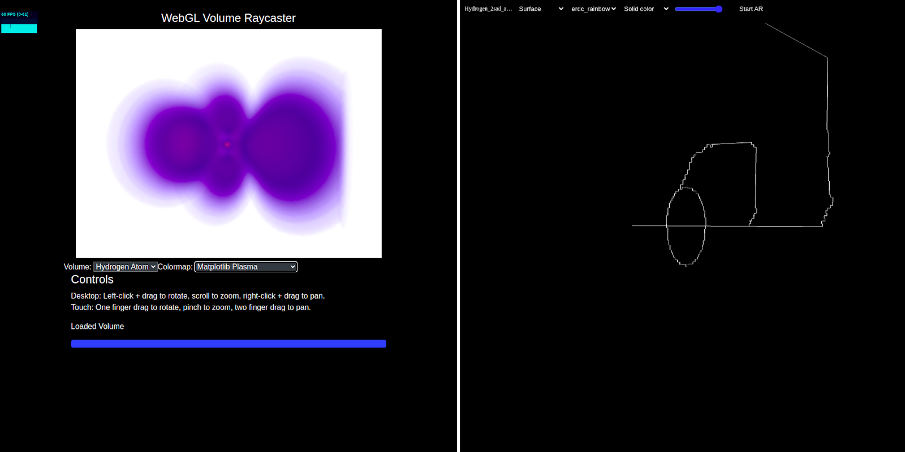

# A web based tool rendering the mentioned algorithms for raycasting in volume rendering and showing the extremum graphs for the data

Topological analysis and scientific visualization has become a key tool in all branches of
research. The topology of scalar fields provides great insight into the working of many natural
phenomena. There are three methods for topological visualizations including contour trees,
morse smale complexes and extremum graphs. The work by Narayan et. al. for the study of time
varying data using extremum graphs and the worky by Thomas el. al. showing augmented
extremum graphs to detect symmetry in scalar fields, all contribute to how important the
topological analysis using extremum graphs has become in the field of scientific visualization. It
provides an abstract yet intuitive representation of the underlying scalar field while also
preserving extrema connectivity. Although there are several works indicating the computation
and use case of extremum graphs, there still needs to be a simple and easy to access visualization
tool for these graphs which makes this project quite simple but important.

Figure showing :
a) on the left- Volume rendering of Hydrogen atom dataset b) On the right- Its extremum graph .

# Description

Volume rendering and visualization implementation consists of four basic steps: setting up the
volume rendering pipeline, loading a remote dataset, applying the ray casting algorithm, shaders
& filters and finally rendering the volume. The pipeline imports multiple vtk.js library functions
for rendering, sampling, shading and composting of the dataset, webGL utilities and glMatrix for 
Matrix/vector operations. The data processing consists of passing the input data source through
the mapper which is further attached to the actor. The data rendering part includes passing the
actor to the renderers which are contained by the render window.
The ray casting pipeline consists of two programmable shader stages: the vertex shader,
responsible for transforming input vertices into clip space, and the fragment shader, responsible
for shading pixels. To optimize the algorithm a bounding box is defined first to scale the volume
for ray marching, omitting the need to traverse in the whole window.
After normalizing the view ray direction received as input from the vertex shader, we intersect it
against the volume bounds in which it computes the step size dt such that each voxel is sampled
and the color and opacity is assigned meanwhile.
This algorithm is then integrated in the pipeline for the web software which can run with vanilla
javascript and html files. Kitware provides many vtk.js visualization libraries like the transfer
functions, filters e.t.c which are used.

# Setting up the Software

The project is easy to set up in your local system. Assumptions involve : git has to be
installed in your system (or if not there must be some other way you can get the project
code). Prefers the latest version of node and npm, although any new npm versions would
still work. Requires php to be installed to run the html server on your local host.
Get the project code
git clone https://github.com/Sigsev-Dev/visualizer.git
And then navigate to the cloned code folder:
cd visualizer
Start the build server
Npm run build
Navigate inside the src/dist folder to find index.html file:
cd src/dist
Run the html file
Php -S localhost:8000
Open the software
Navigate to localhost:8000 on your browser.

# Using the Software

The software is a simple web tool after it is build and running on your local host just go to
that port on your browser, and you’ll find a screen like this:
Here there are two sections in the window browser parted by a middle line. The one on
the left represents the volume rendering of the datasets using the ray casting mechanism. This
contains multiple preloaded volumes from the scientific visualization dataset. You can click on
the dropbox and choose the suitable dataset for the volumetric rendered visualization of it. Also
there are options for several texture mapping with the next dropbox. You can click on it as well
to choose the desired colormaps. The interaction of the dataset is just mouse input handlers,
pinch, zoom hold and drag to get the best visualization and analysis of it.
On the right hand side we can see a symbol for uploading files when the page first loads.
The user can simply click on it which will show a pop up option to upload files from the local
system. Currently as the software only supports graphs in .vtp format, we have to choose the
appropriate extremum graph in the same format. There are multiple ways to achieve the same
and have the graphs in .vtp format. One simple method is by using Paraview to apply the TTK
scalar field filters and the morse smale structure with appropriate specifications and then saving
the file in the required format.
